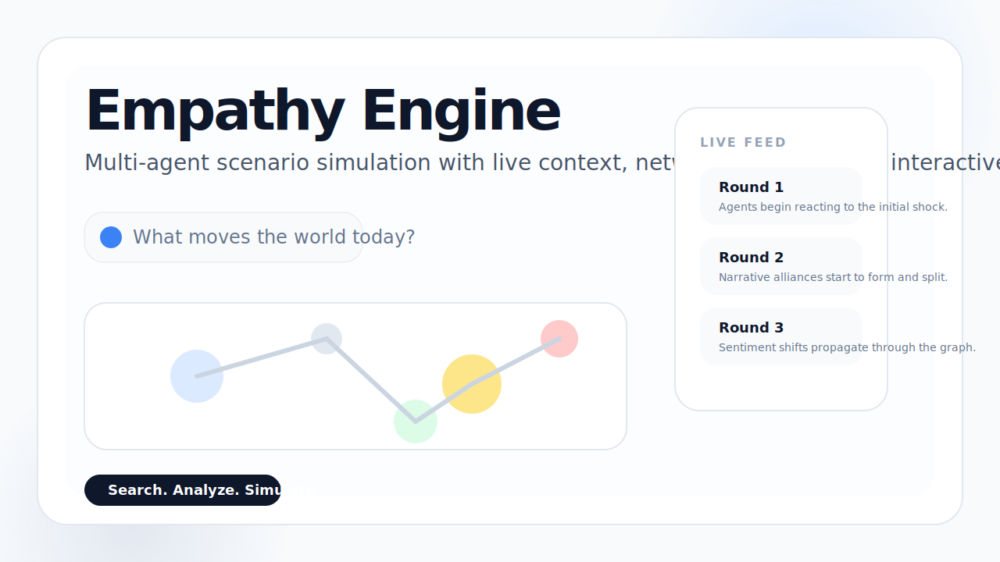
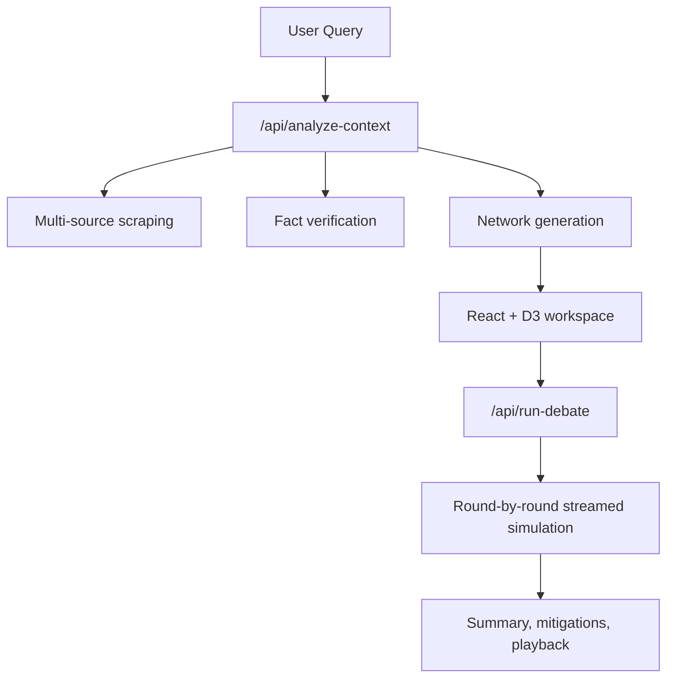

# Empathy Engine



Empathy Engine is a search-first, multi-agent scenario sandbox for geopolitical, socio-economic, and narrative stress testing. It maps actor networks from live context, proposes simulation paths, and streams debate rounds in real time through a modern interactive frontend.

## What it does

- Scrapes and synthesizes live context from multiple public sources
- Verifies current facts before network generation
- Spawns large multi-agent networks with structured JSON output
- Streams analysis and debate state over SSE
- Visualizes sentiment shifts through an interactive D3 canvas
- Preserves simulation memory through local persistence

## Stack

- Backend: Python, FastAPI, CrewAI, LiteLLM, SQLite, ChromaDB
- Frontend: React, Vite, Tailwind CSS, D3
- Transport: Server-Sent Events for live analysis and simulation updates

## Brand Assets

Project media for GitHub, hackathon submissions, and demo pages is included in:

- `docs/assets/empathy-engine-logo.svg`
- `docs/assets/empathy-engine-mark.svg`
- `docs/assets/empathy-engine-social-preview.svg`
- `docs/assets/empathy-engine-readme-hero.svg`
- `frontend/public/brand/logo.svg`
- `frontend/public/brand/social-preview.svg`
- `frontend/public/favicon.svg`

## Quick Start

### Backend

```bash
python -m venv .venv
.venv\Scripts\activate
pip install -r requirements.txt
python api.py
```

### Frontend

```bash
cd frontend
npm install
npm run dev
```

Open [http://localhost:5173](http://localhost:5173).

## Validation

Backend regression suite:

```bash
py tests/test_blackbox.py
```

Frontend checks:

```bash
cd frontend
npm run lint
npm run build
```

## Architecture



## Notes

- The frontend is now aligned to a light, minimal, modern visual direction.
- SSE payload formatting remains intact.
- The right-click canvas interaction guardrail should stay preserved in future iterations.
